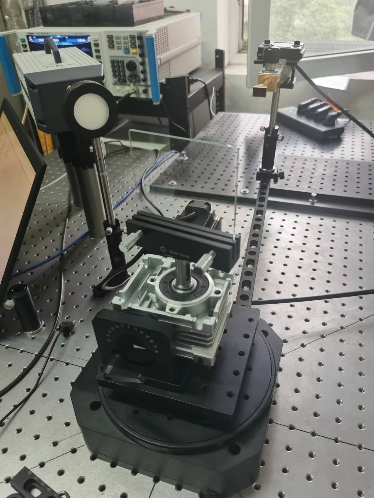
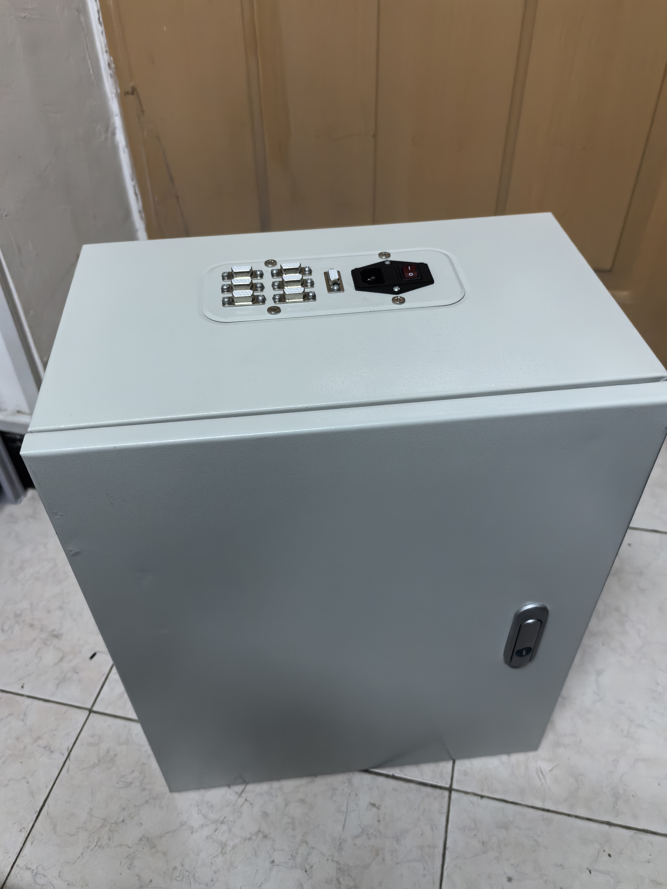

# 410自动实验系统（v2.0）

--2023.12.18，ljc

> 一个人就能优雅的做实验

### 版本记录

* v2.0(当前分支)：全新的五轴控制箱；新的双平移台、俯仰台和双转台；新的sdk代码封装思路
* v1.7.0（未完成）：配套打包上位机软件
* v1.6.0（未完成）：支持远程通信控制，
* v1.5.0（主分支）：支持200mm转盘和300mm转盘的协同控制
* v1.4.0（未发布独立分支）：支持思仪1465信号发生器
* v1.3.0（未发布独立分支）：支持恒誉激光300mm实心转盘的其他采样方式，底层系统框架大更新
* v1.2.0（旧版本）：计划支持基于200mm转台的圆环旋转连续序列采样
* v1.1.2（旧版本）：文档版本，文档拆分为开发文档和快速上手文档
* v1.1.1（旧版本）：优化版本，采用更简洁的参数配置方法，支持txt、csv、xlsx数据保存格式，更友好的命令行交互
* v1.1.0（旧版本）：整合200mm电机转盘，实现圆环旋转跨步序列采样
* v1.0.1（旧版本）：arduino驱动小步进电机，实现中心旋转跨步序列采样

## 警告！

* 系统控制的机械结构具有一定危险性，所搭载的实验器材贵重，使用不当很有可能会造成人员受伤或设备损坏。运行前要着重关注旋转角度、速度、加速度等参数配置的正确性。新手和重要版本更新时请认真阅读系统文档，初次使用请在他人指导下进行实验。
* #### 有任何疑问不要莽，先找作者咨询！！！

## [News] 全新的控制箱！

## 1.系统特性

### 全新的SDK式接口封装

* 更灵活的多设备控制
* 简单易上手的脚本写法

### 多仪器联合控制

* 通过交换机局域网联通多种Visa设备，通过控制板电路改装联通多种串口设备。
* 已支持常见采样动作
* 支持快速脚本定制复杂采样动作

### 友好的人机交互

* 目前支持命令行交互式控制，如有改进意见请联系作者

### 自动化特性

* 自动设置Tx、Rx参数，自动开启信号
* 自动绘制采样数据曲线，自动展示
* 自动保存采样数据，支持txt、csv、xlsx三种数据保存格式
* 单次扫频和跨步旋转采样时间在分钟量级，连续旋转采样时间在秒量级

## 2.支持的设备和动作

### 2.1.Tx & Rx

* 设置倍频
* 设置频率
* 设置功率
* 开/关信号
* 设置平均次数（待支持）
* 单次读取数据
* 连续读取数据（待支持）

### 2.2.电控设备（200mm转台、300mm转台、双400mm平移台、俯仰台）

* 设置零点
* 设置加速加速度、减速加速度、最大速度
* 阻塞相对定位运动
* 阻塞绝对定位运动
* 异步相对定位运动（待支持）
* 异步相对定位运动（待支持）
* 查询位置、速度

### 2.3.定时设备

* 定时等待

### 2.4.记录器

* 设置字段
* 记录数据

## 3.基于本系统的实验

* 2023 410室内实验
  * PVC管散射实验
  * 金属表面粗糙度实验
  * 玻璃反射透射实验
  * 沥青扫频实验
  * 玻璃反射透射实验
  * 种子实验
  * 羽毛实验
  * 空间碎片实验
  * 降雨实验
  * 周期表面实验
* 2023第一次良乡实验
  * 办公室场景水平全角度散射实验 
  * 玻璃门透射实验
  * 步行通过、推门通过实验
  * 门缝实验
  * 玻璃、墙面、银幕散射实验
  * 吧台场景水平散射实验 
  * 泳池水面波动实验
  * 泳池角度扩散实验
* 2023第二次良乡实验
  * 办公室场景垂直全角度散射实验
  * 室内玻璃、墙面散射实验
  * 草地散射实验
  * 无人机实验
  * 降雨实验
  * 地面反射实验
  * 室外墙面反射实验
  * 沥青路面散射/扫频实验
* 2023第三次良乡实验
  * 无人机实验
* 2023冬季实验
  * 室外降雪实验

## 3.系统文档

v2相关文档正在开发中，了解本系统可适当参考v1相关文档：

* 了解v1代码目录请参考[文件树](utils/doc/Development.md#31%E6%96%87%E4%BB%B6%E6%A0%91)。
* 普通用户 
  * 请参考未完成版的[快速上手](utils/doc/QuickStart.md)
* 开发者 
  * 请参考未完成版的[开发手册](utils/doc/Development.md)

