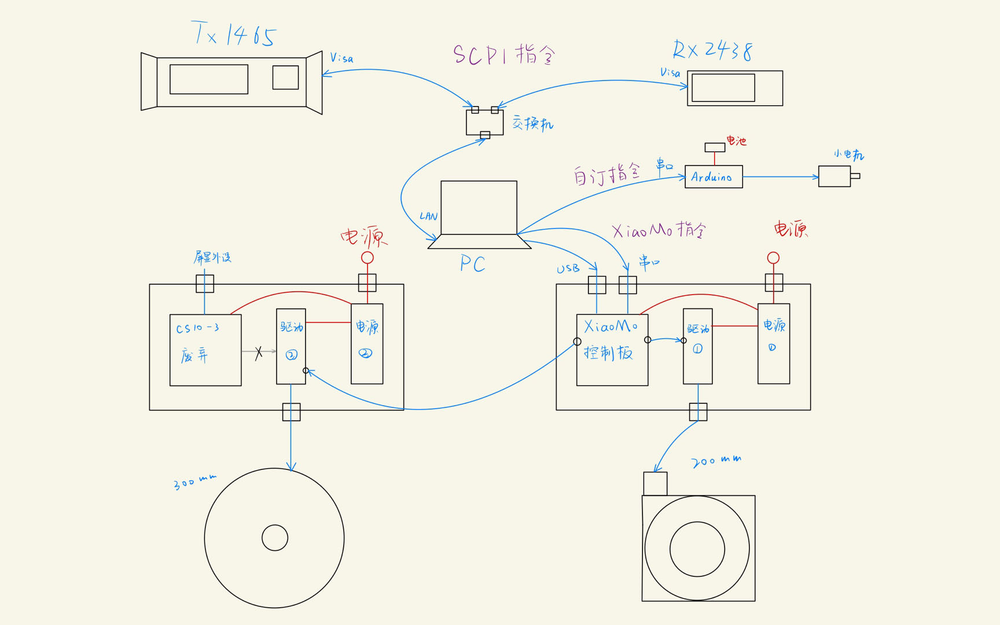

# 410自动实验系统（v5.0）

--2023.5.5，ljc

> 一个人就能优雅的做实验

### 版本记录

* v6.0（未完成）：配套打包上位机软件
* v5.0（主分支）：支持200mm转盘和300mm转盘的协同控制
* v4.0（未发布独立分支）：支持思仪1465信号发生器
* v3.0（未发布独立分支）：支持恒誉激光300mm实心转盘的其他采样方式，底层系统框架大更新
* v2.0（旧版本）：计划支持基于200mm转台的圆环旋转连续序列采样
* v1.2（旧版本）：文档版本，文档拆分为开发文档和快速上手文档
* v1.1（旧版本）：优化版本，采用更简洁的参数配置方法，支持txt、csv、xlsx数据保存格式，更友好的命令行交互
* v1.0（旧版本）：整合200mm电机转盘，实现圆环旋转跨步序列采样
* v0.1（旧版本）：arduino驱动小步进电机，实现中心旋转跨步序列采样

## 警告！

* 系统控制的机械结构具有一定危险性，所搭载的实验器材贵重，使用不当很有可能会造成人员受伤或设备损坏。运行前要着重关注旋转角度、速度、加速度等参数配置的正确性。新手和重要版本更新时请认真阅读系统文档，初次使用请在他人指导下进行实验。
* #### 有任何疑问不要莽，先找作者咨询！！！

#### 	

## 1.系统特性

### 多仪器联合控制

* 通过交换机局域网联通多种Visa设备，通过控制板电路改装联通多种串口设备。
* 已支持常见采样动作
* 支持快速脚本定制复杂采样动作

### 友好的人机交互

* v5.0前支持命令行交互式控制，如有改进意见请联系作者
* v6.0计划支持GUI上位机

### 自动化特性

* 自动设置Tx、Rx参数，自动开启信号
* 自动绘制采样数据曲线，自动展示
* 自动保存采样数据，支持txt、csv、xlsx三种数据保存格式
* 单次扫频和跨步旋转采样时间在分钟量级，连续旋转采样时间在秒量级

## 2.支持的采样动作

### 1.环型旋转跨步采样

* PVC管散射实验完成实测

### 2.环型旋转连续采样

* 金属表面粗糙度实验完成实测

### 3.中心旋转跨步采样

* 玻璃反射透射实验完成实测

### 4.中心旋转连续采样

### 5.频率跨步采样

* 沥青扫频实验完成实测

### 6.定制化联合控制

* 玻璃反射透射实验完成实测

* 请联系作者定制采样脚本，可定制的设备参数包括：
  * Tx：频率、功率、倍频
  * Rx：频率、查询频率、各种采样参数
  * 中心轴：方向、速度、角度、变速运动
  * 圆环轴：方向、速度、角度、变速运动

## 3.系统文档

5.0版本是一个底层设计相对成熟，完整支持当前全部设备的版本。若不添加新设备，后续的更新将以维护和修缮为主，架构设计理论上不会再有大范围调整。5.0版本文档仍在编写中，将持续更新。

了解代码目录请参考[文件树](./doc/Development.md#31%E6%96%87%E4%BB%B6%E6%A0%91)。

新版本同样支持原采样方案，细节略有改动，如有问题请联系我。

### 普通用户

请参考未完成版的[快速上手](./doc/QuickStart.md)

### 开发者

请参考未完成版的[开发手册](./doc/Development.md)

