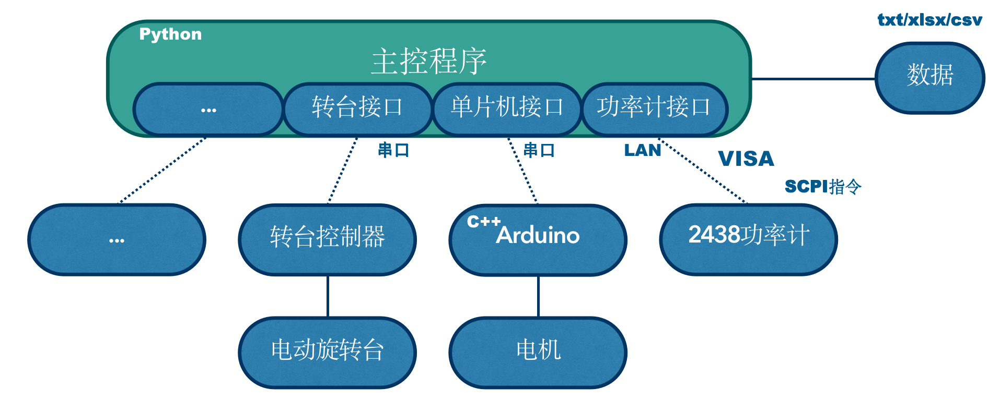
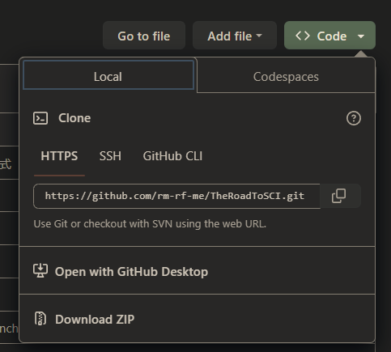
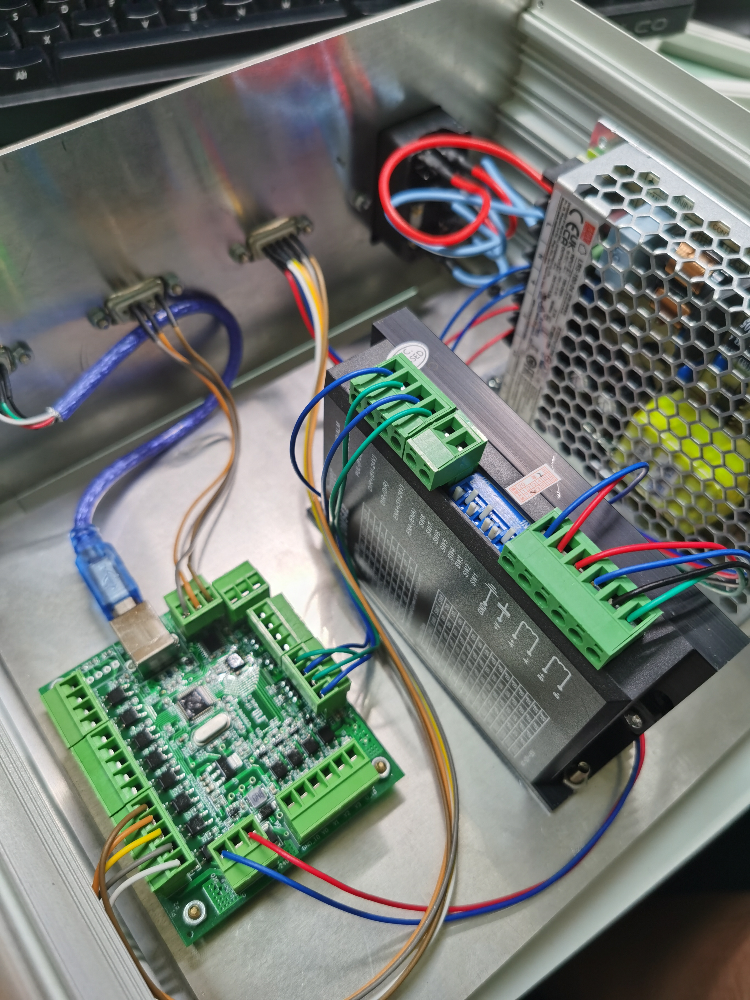
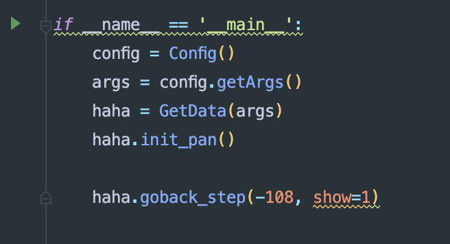
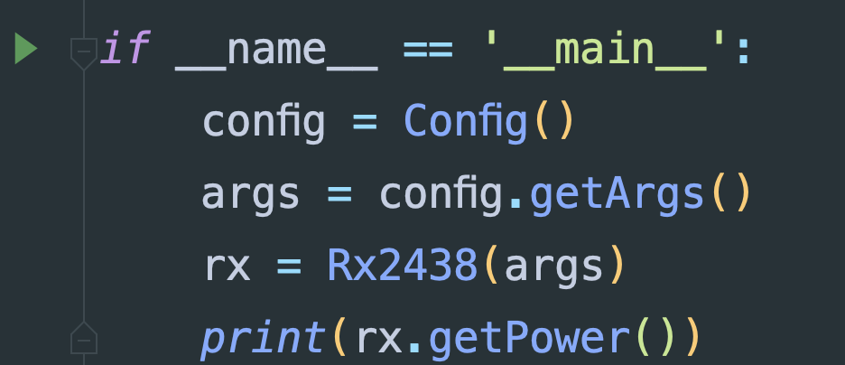
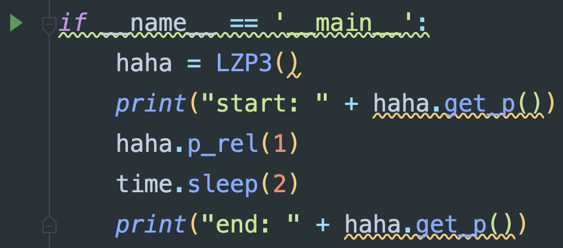

# 410自动实验系统开发手册（v5.0）

--2023.4.26，ljc

> 一个人就能优雅地做实验

## 警告！

* 系统控制的机械结构具有一定危险性，所搭载的实验器材贵重，使用不当很有可能会造成人员受伤或设备损坏。运行前要着重关注旋转角度、速度、加速度等参数配置的正确性。新手和重要版本更新时请认真阅读系统文档，初次使用请在他人指导下进行实验。
* 有任何疑问不要莽，先找作者咨询！！！

[TOC]

## 0.系统简介


本系统是以Python语言为主的、联合控制多种仪器设备协同进行太赫兹实验和数据采样的自动化系统。工程遵循面向对象思想，具有良好的扩展性和灵活性。支持LAN、串口、VISA多种通信协议，能对接包括微波功率计、信号发生器、电动旋转台、步进电机、单片机等设备。转台设备精度达到0.01度、单点采样时间在100ms以内，通讯时延低，实现序列数据的自动化采样和保存。



## 1.前置知识

### 1.1.Git/Github

* git
    * git是著名的版本控制工具，能够方便进行版本更新、回滚、多分支开发等版本管理操作
    * 可至官网免费安装
* github/gitee
    * 基于git的版本共享仓库，有时需要科学上网
    * 本项目仓库路径为
        * github：https://github.com/rm-rf-me/TheRoadToSCI
        * gitee：https://gitee.com/ljcljcljcljcljc/TheRoadToSCI
* 代码拉取方法
    * 安装git

    * 打开cmd命令行，cd到对应路径，git clone https://github.com/rm-rf-me/TheRoadToSCI.git

    * 或直接web端下载zip

  

### 1.2.Python

* 本项目使用conda进行环境管理，关于python环境配置请参考https://github.com/rm-rf-me/Python-Setup-tutorial
* 主要包：
    * pyvisa
    * pyserial
    * pandas
    * tqdm
    * eventlet
    * matplotlib

### 1.3.Visa

### 1.4.串口通信

### 1.5.Arduino

### 1.6.步进电机

* 步进电机是一种以脉冲控制的封装更好的电机，电机获得一定数量的脉冲信号后即会旋转一个单位的步进角，该步进角精度高，不受负载情况影响，故步进电机具备很高的控制精度。

#### 1.6.1.控制结构

* 2相步进电机的输入通常是A+ A- B+ B-四根线，通常情况下实现对步进电机的控制需要以下几个部分：

    * 电源：为驱动版和控制板供电
    * 电机驱动板：输出为四线或六线直接控制电机，输入为脉冲、方向等
    * 电机控制板：输出为驱动板脉冲、方向等控制信号，支持外接设备、串口、USB、烧录程序等控制方式
    * 控制程序：运行在PC端，和控制板进行交互

* 200mm转盘控制箱结构如图：

  

  其中从左至右依次为电机控制板、电机驱动版和电源。控制箱外部暴露四个接口，在途中从左至右依次为：USB控制线、rx232串口控制线、电机控制线、电源接口。

#### 1.6.2.参数配置

* 常见的电机参数有：
    * 细分数：即获得多少个脉冲后前进一个步进角，该参数与电机驱动板设置有关，在200mm转盘中为20，在小电机中为16
    * 步进角：即一次步进前进的读书，常见默认1.8度
    * 传动比：即电机转轴和转台或平移台之间的机械比例关系，在200mm转台中为1:180，在小电机中为1:1

## 2.环境配置

### 2.1.Python环境

* 本项目使用conda进行环境管理，关于python环境配置请参考https://github.com/rm-rf-me/Python-Setup-tutorial
* 主要包：
    * pyvisa
    * pyserial
    * pandas
    * tqdm
    * eventlet
    * matplotlib

### 2.2串口

#### 2.2.1.驱动

#### 2.2.2.串口助手

### 2.3.Visa

### 2.4.编程环境

### 2.5.电机转盘

#### 2.5.1.控制箱改装

#### 2.5.2.上位机

## 3.代码框架

### 3.1.文件树

* 以 Device_ 开头代表设备接口类
* 以 XXXSampling_ 开头代表数据采样形式
    * AnnularSampling：环型采样，旋转Rx或Tx
    * CentralSampling：中心采样，旋转中心物体

```c
.
├── AnnularSampling_HY300mm		// 中心采样恒誉激光生产的300mm转台
│   ├── ContinuousConfig.py
│   ├── ContinuousSampling.py
│   ├── StepConfig.py
│   ├── StepSampling.py
│   └── data
│       └── __init__.py
├── AnnularSampling_HYGX
│   ├── ContinuousConfig.py
│   ├── ContinuousSampling.py
│   ├── StepConfig.py
│   └── StepSampling.py
├── CentralSampling_LittleMotor
│   ├── GetData.py
│   ├── config.py
│   └── data
│       └── __init__.py
├── CoSampling
│   └── Glass
│       ├── config.py
│       ├── data
│       │   └── __init__.py
│       └── sampling.py
├── Device
│   ├── Device_Ceyear
│   │   ├── RX2438.py
│   │   ├── TX1465.py
│   │   └── __init__.py
│   ├── Device_HengYangGuangXue
│   │   ├── LZP3.py
│   │   └── __init__.py
│   ├── Device_LittleMotor
│   │   ├── LittleMotor.py
│   │   ├── __init__.py
│   │   └── arduino
│   │       └── Emm42_Arduino_WHILE.ino
│   ├── Device_ShenZhenHengYu
│   │   ├── HY300mm.py
│   │   └── __init__.py
│   ├── __init__.py
│   └── util
│       ├── Serial.py
│       ├── XiaoMo.py
│       └── __init__.py
├── FreqSampling_1465
│   ├── StepConfig.py
│   ├── StepSampling.py
│   └── data
│       └── __init__.py
├── README.md
├── Tool
├── doc
│   ├── Development.md
│   ├── QuickStart.md
│   ├── img
│   │   └── *.png
│   ├── 开发手册.pdf
│   └── 快速上手.pdf
├── script
│   ├── __init__.py
│   ├── get_lstm_data.py
│   └── get_pvc_data.py
└── utils
    ├── __init__.py
    ├── cmdIO.py
    ├── config
    │   ├── __init__.py
    │   └── base_config.py
    └── sampling
        ├── __init__.py
        ├── base_sampling.py
        ├── freq_sampling.py
        └── xiaomo_sampling.py
```

* 如果没有开发意愿，则可以忽略所有Device开头的路径。只需关注每个XXXSampling开头的采样路径

### 3.2.XXXSampling

* 规定该路径下会包含以下内容：

    * GetData.py：主函数
    * config.py：配置文件
    * data/：数据保存位置

  其余内容可以不关注

### 3.3.GetData.py

* 文件最下方都包含类似结构，为当前采样的主运行脚本，点击绿色三角即可运行，注意一定要先确认运行配置无误！！！

  

### 3.4.参数配置

* 本项目需配置的参数较多，主要包含以下几类：

    * 设备参数：用户不用考虑
    * 采样基础参数：用户不用考虑
    * 采样参数：需要配置

* 其中的采样参数即为旋转角、步长、步延迟等根据采样需求调整的参数，主要有三种配置途径：

    1. 关键参数在命令行中交互配置
    2. 函数调用传参
    3. config.py文件配置

  注意三种参数的优先级递减，也就是说函数传参会覆盖config.py配置，而命令行交互会覆盖函数传参

## 4.采样场景

### 4.1.中心旋转跨步序列采样

#### 4.1.1.支持设备

* 42小电机

#### 4.1.2.主要类方法

### 4.2.圆环旋转跨步序列采样

#### 4.2.1.支持设备

* 200mm电机转台

#### 4.2.2.主要类方法

##### 转盘初始化

```python
GetData.init_pan(acc=5, dec=5, v=5)
```

* 配置电机参数，并设置当前位置为零点

##### 单向采样

* series代表序列，step代表单步模式，rel代表相对角度模式，即相对初始位置计算角度。

  ```python
  GetData.get_series_step_rel(
    max_angle=None, # 旋转目标角
    delay=None, 		# 单步延时
    stride=None, 		# 步长
    step_block=None, # 单步阻塞
    show_pic=None,	# 序列展示曲线
    save_pic=None, 	# 保存曲线
    data_type=None	# 保存数据格式
  )
  ```

* 单向采样函数，不建议使用，建议使用往返采样goback_step函数

##### 往返采样

```python
GetData.goback_step(
  max_angle=None, 		# 参数同上
  delay=None, 
  stride=None, 
  step_block=None, 
  show_pic=None, 
  save_pic=None, 
  data_type=None
)
```

* 该函数直接调用了get_series_step_rel函数，控制电机做两次为一组的往返运动，最终电机回到初始位置，能保证每次采样的角度一致性，相对更加安全。

##### 配置参数

* 配置函数内容如下：

  ```python
  # 当前使用的频率，字符串形式，用于记录
  self.parser.add_argument('--freq', type=str, default="None")
  
  # 当前使用的功率，浮点数形式，用于记录，单位为dbm
  self.parser.add_argument('--power', type=float, default=0)
  
  # 加速加速度，米/秒^2
  self.parser.add_argument('--acc', type=float, default=8)
  
  # 减速加速度，米/秒^2
  self.parser.add_argument('--dec', type=float, default=6)
  
  # 最大速度阈值，米/秒，超过15会丢步
  self.parser.add_argument('--v', type=float, default=8)
  
  # 步内等待时间，从转盘完全停止开始计时，秒
  self.parser.add_argument('--delay', type=float, default=0.2)
  
  # 步长，可以是小数
  self.parser.add_argument('--stride', type=float, default=2)
  
  # 从当前位置开始的最远转动角度，一定要小心不要打到东西；正数为顺时针，负数为逆时针
  self.parser.add_argument('--max_angle', type=float, default=10)
  
  # 单条数据采样结束后是否展示曲线
  self.parser.add_argument('--show_pic', type=bool, default=True)
  
  # 单条数据采样结束后是否保存曲线
  self.parser.add_argument('--save_pic', type=bool, default=False)
  
  # 每步采样后是否阻塞等待
  self.parser.add_argument('--step_block', type=bool, default=False)
  
  # 数据保存格式，支持txt、xlsx、csv
  self.parser.add_argument('--data_type', type=str, default='txt')
  ```

* 需要对对应参数进行修改时，仅需更改default=后面的默认值即可

## 5.采样步骤

### 5.1.中心旋转跨步序列采样

### 5.2.圆环旋转跨步序列采样

#### 1.设备搭建

* 功率计使用网线连接
* 控制箱开机，连接黑色串口线和蓝色usb线
* 直尺固定，RxTx固定对齐
* 信号发生器开机，放大器开机，配置信号参数
* 功率计开机，配置参数

#### 2.设备测试

* 运行Device_Ceyear/RX2438.py文件，打印功率即为连接成功

  

* 运行Device_HengYangGuangXue/LZP3.py文件，电机旋转一度即为连接成功    

#### 3.初始位置

* 使用转盘上位机软件，测量出目标采样角度范围
* 小心碰撞

#### 4.采样参数配置

* 设置config文件

#### 5.开始测量

* 运行GetData.py文件，等待结果
