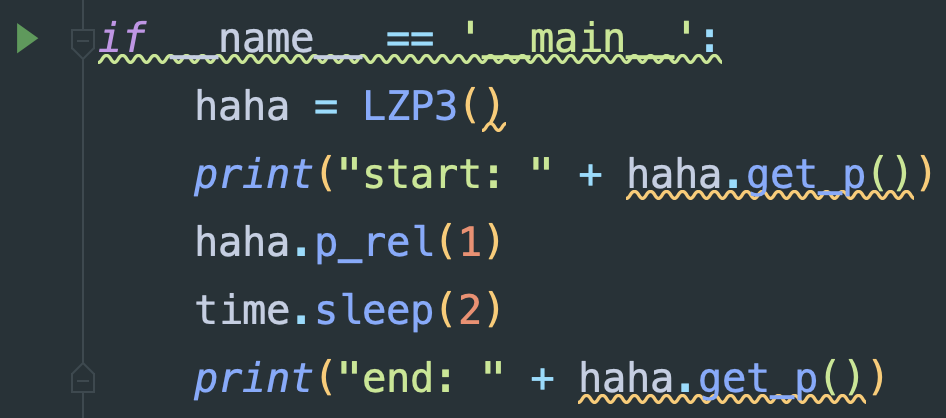

# 410自动实验系统快速上手（v1.2）

--2023.3.26，by ljc

## 警告！

* 系统控制的机械结构具有一定危险性，所搭载的实验器材贵重，使用不当很有可能会造成人员受伤或设备损坏。运行前要着重关注旋转角度、速度、加速度等参数配置的正确性。新手和重要版本更新时请认真阅读系统文档，初次使用请在他人指导下进行实验。
* 有任何疑问不要莽，先找作者咨询！！！

[TOC]

本文讨论系统在实验室ThinkPad笔记本电脑上的使用方法。

## 接线方式

实验室ThinkPad笔记本电脑需连接：

* 电源线
* 功率计蓝色网线
* 电机控制箱的蓝色黑色两根usb接口线

## 软件位置

### 项目代码及版本选择

* 由于不同版本间代码差距较大，在运行前请详细核对代码版本和对应使用方法。

* 不出意外的情况，电机桌面的Pycharm打开的就是本项目工程代码。如果不是，请于右下角最近项目出选择，或于左上角项目-打开菜单中打开D:/Project/TheRoadToSCI路径。

* 本项目使用git/github进行版本管理和代码分发，需在使用前确认当前版本。点击界面右下角的分支图标：

  

  可以浏览到本地和远程的多个版本分支：

  * master分支：版本主分支，是当前通过实测的最新版本，可参考最新版文档开头的版本记录。

  * vX.X分支：X为数字，代表该版本的最后一个稳定分支，用于快速回退到历史版本

    其余版本都可以忽略

* 选择好对应版本后单击，选择**签出**，如提示签出问题则选择**智能签出**

* 待下方进度条完成后可发现代码回退到了对应版本。

### 转盘上位机

### 串口调试

### VISA口调试

## 采样步骤

### 中心旋转跨步序列采样

### 圆环旋转跨步序列采样

#### 1.设备搭建

* 功率计使用网线连接
* 控制箱开机，连接黑色串口线和蓝色usb线
* 直尺固定，RxTx固定对齐
* 信号发生器开机，放大器开机，配置信号参数
* 功率计开机，配置参数选择对应测量频率

#### 2.设备测试

* 运行Device_Ceyear/RX2438.py文件，打印功率即为连接成功

  

* 运行Device_HengYangGuangXue/LZP3.py文件，电机旋转一度即为连接成功	

#### 3.初始位置

* 使用转盘上位机软件，测量出目标采样角度范围
* 小心碰撞

#### 4.采样参数配置

* 设置config文件

#### 5.开始测量

* 运行GetData.py文件，等待结果